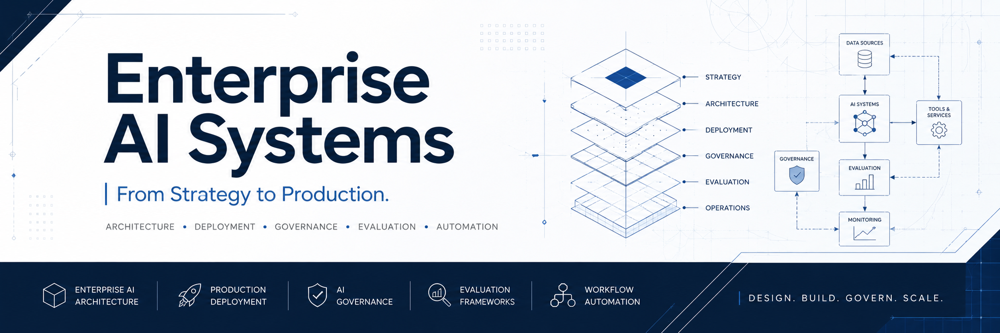

  

# Marquiano

### Designing Enterprise AI Systems — From Strategy to Production

I design enterprise AI systems that organizations can deploy, govern, evaluate and scale with confidence.

---

## About

My work focuses on transforming AI initiatives into production-ready systems through sound architecture, governance, deployment practices and operational excellence.

Core domains include:

- Enterprise AI Architecture
- AI Deployment
- AI Governance
- Production AI
- Evaluation Frameworks
- Workflow Automation
- Cognitive Runtime Architectures

---

## Featured Projects

| Project | Status |
| --- | --- |
| [Enterprise AI Playbook](https://github.com/marquiano/enterprise-ai-playbook) | ✅ Active — canonical reference for Enterprise AI architecture, governance & operations |
| [AI Knowledge Assistant (RAG)](https://github.com/marquiano/ai-knowledge-assistant-rag) | 🚧 Upgrading to production-grade (evaluation, testing, CI) |
| AIMOS | ✅ Active |

---

## Roadmap

- Production-grade RAG reference implementation (evaluation, testing, CI/CD)
- Enterprise AI Evaluation Framework
- Case studies & implementation examples documented inside the Enterprise AI Playbook
- GitHub Pages Engineering Portfolio

---

## Connect

[LinkedIn](https://www.linkedin.com/in/marquiano/)

Website *(coming soon)*